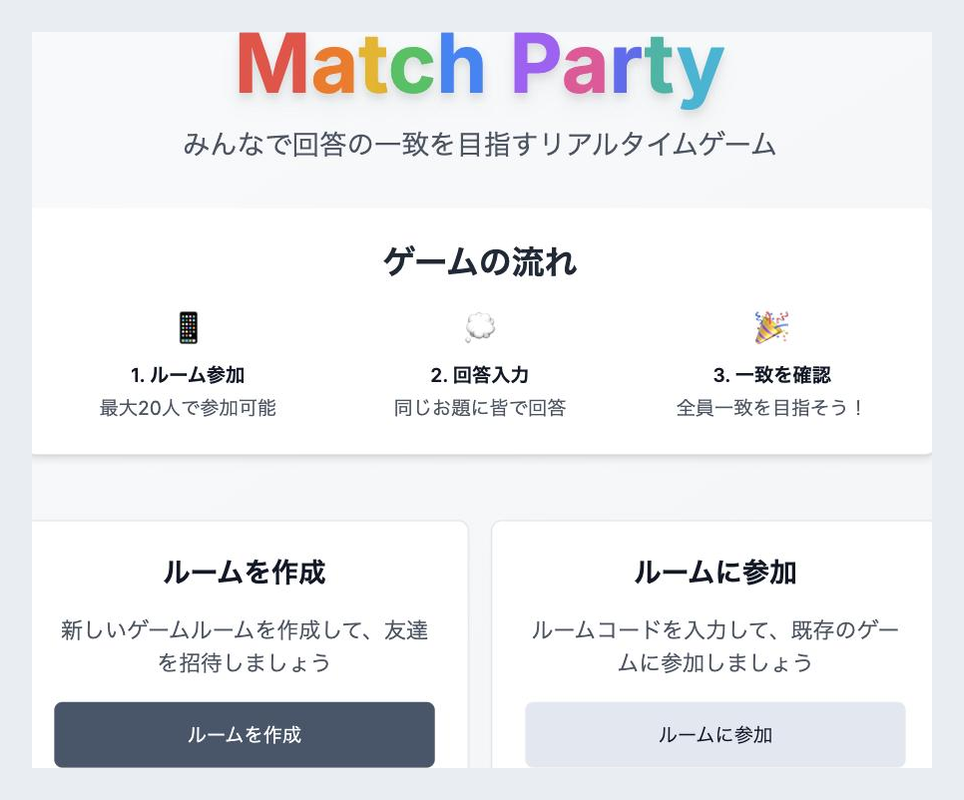
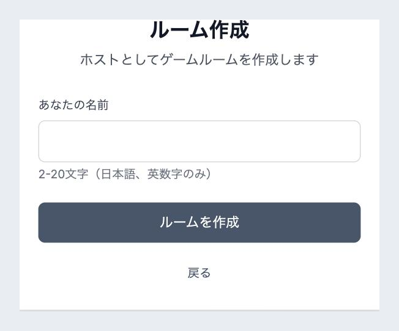
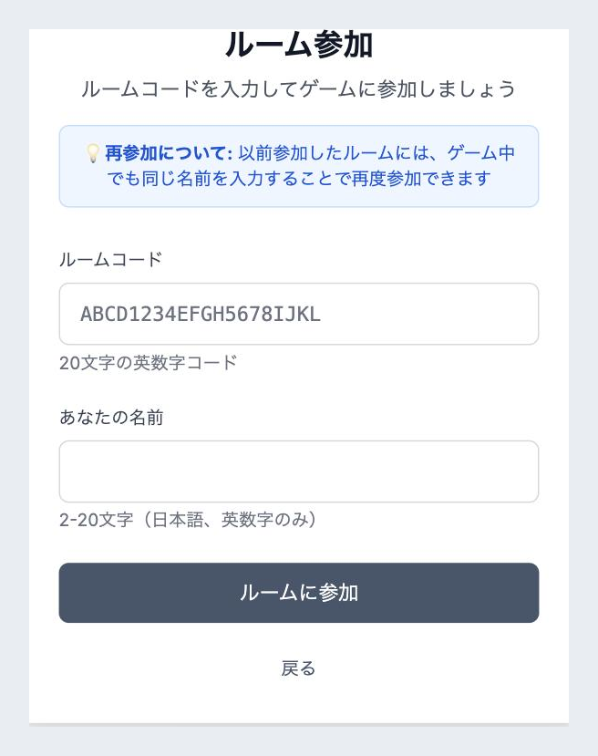
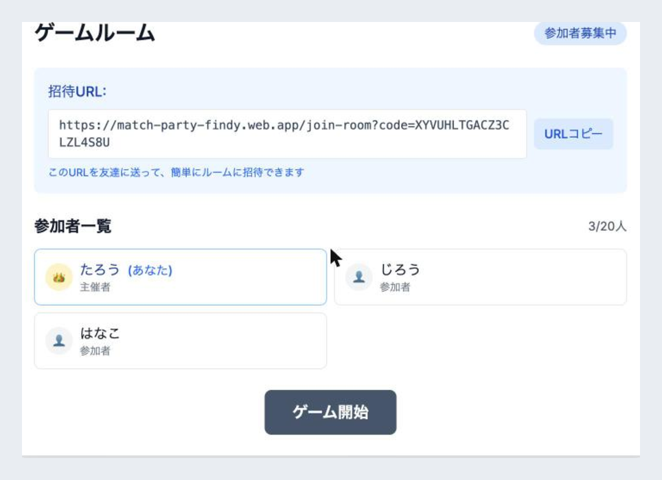
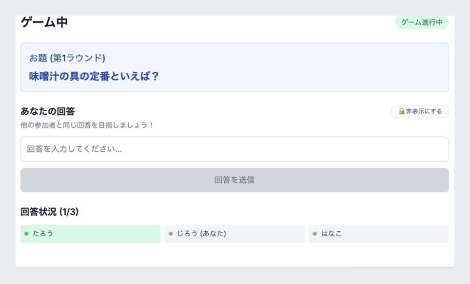
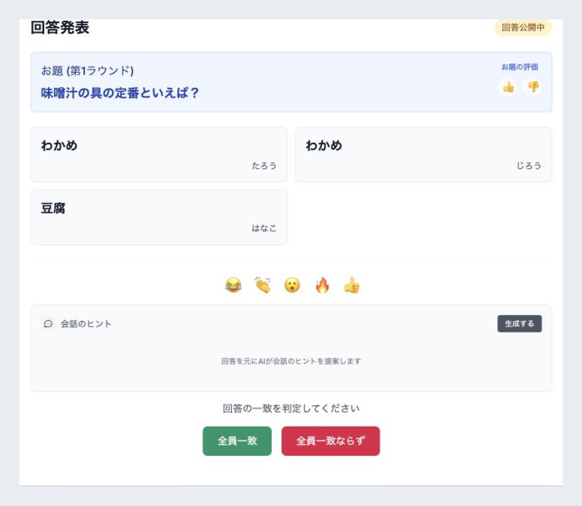
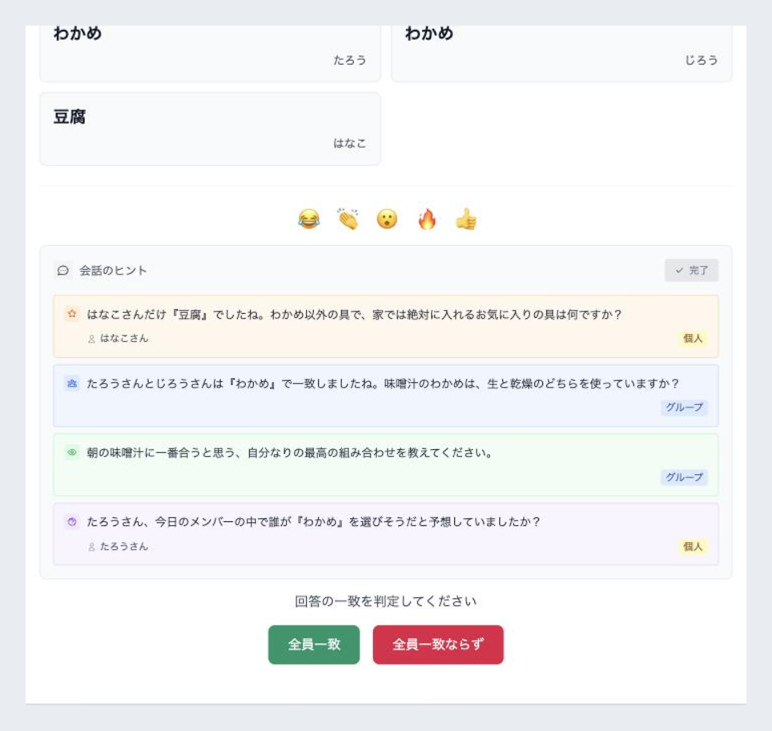
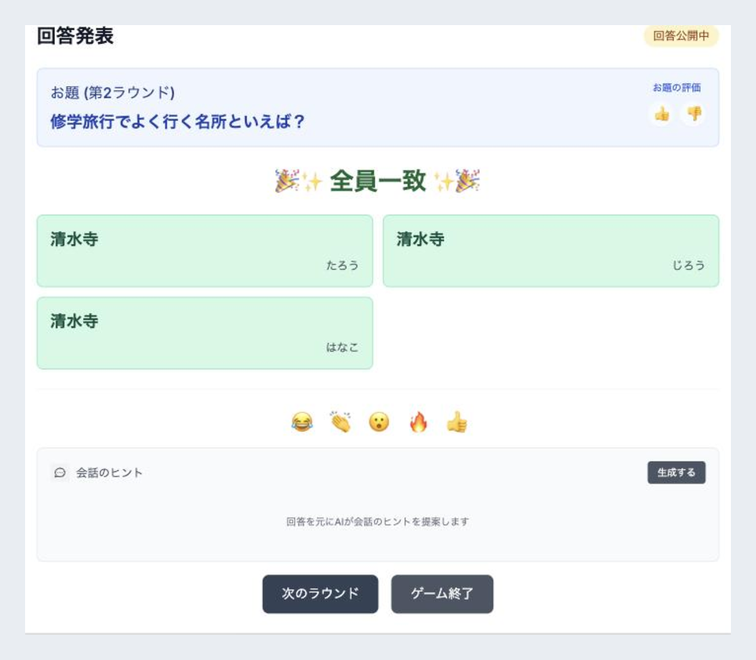
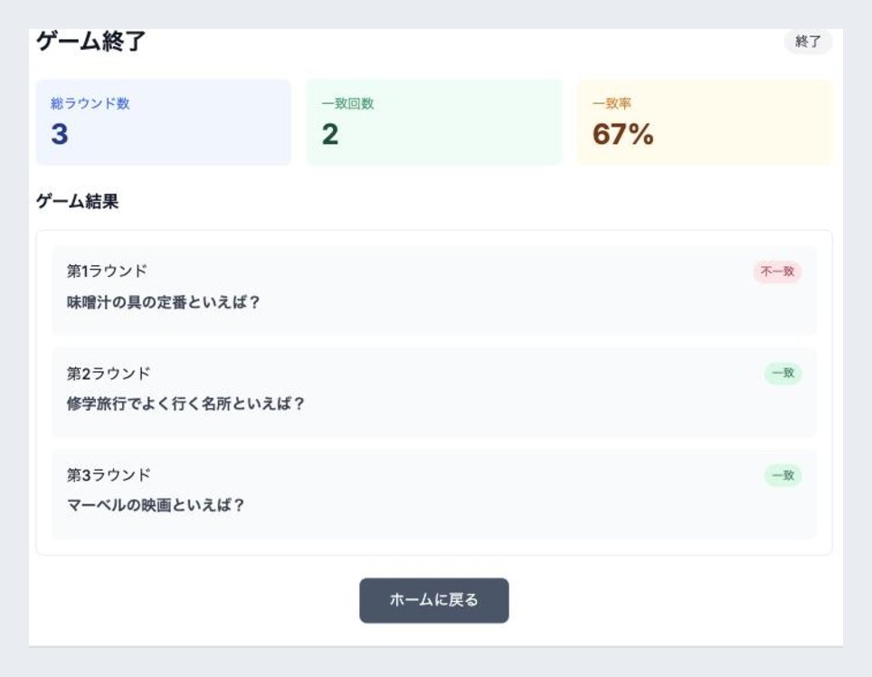

# Match Party

リアルタイムお題回答一致ゲーム - みんなで同じ答えを目指そう！

## ゲーム概要

プレイヤー全員が同じお題に回答し、回答の一致を目指すリアルタイムゲームです。

### 特徴
- **スマホ対応**: タブレット・スマートフォンで快適にプレイ
- **大人数対応**: パーティーゲームに最適
- **リアルタイム**: 参加者の状況をリアルタイムで同期
- **簡単参加**: ルームコードで簡単に参加可能
- **豊富なお題**: 多様なお題でゲームが飽きない
- **エンタープライズ品質**: MVP + Facade + Container-Component統一アーキテクチャ

## スクリーンショット

実際の画面と、ゲーム開始から結果発表までの流れを紹介します。



### 1. ルームを作成 / 参加する

主催者が名前を入力してルームを作成し、発行された招待URL（またはルームコード）を参加者に共有します。参加者はコードと名前を入力するだけで参加できます。

| ルーム作成 | ルーム参加 |
| --- | --- |
|  |  |

### 2. 参加者が集まったらゲーム開始

参加者一覧がリアルタイムで更新されます。2人以上そろうと主催者の「ゲーム開始」ボタンが有効になります。



### 3. 同じお題にそれぞれ回答

全員に同じお題が表示され、他の参加者と一致することを目指して回答を入力します。誰が回答済みかもリアルタイムで分かります。



### 4. 全員の回答を公開・リアクション

全員が回答すると自動で公開。お題やその場の空気にスタンプでリアクションできます。



### 5. AIが会話のヒントを提案

公開された回答をもとに、AIがグループ／個人向けの深掘り質問を生成。盛り上がりをファシリテートします。



### 6. 主催者が一致を判定

主催者が「全員一致」か「全員一致ならず」を判定。結果は全参加者へ演出付きで配信されます。



### 7. リザルトでふりかえり

ゲーム終了時に総ラウンド数・一致回数・一致率とラウンドごとの結果を表示します。



## 本番サイト

**現在稼働中**: https://match-party-findy.web.app/

## 技術スタック

### フロントエンド
- **Next.js 15**: App Router + Static Export
- **TypeScript**: 厳密な型安全性
- **Tailwind CSS**: ユーティリティファーストCSS
- **MVP パターン**: 全ページ統一アーキテクチャ

### バックエンド・インフラ
- **Firebase Firestore**: リアルタイムデータベース
- **Firebase Cloud Functions v2**: 自動クリーンアップ・サーバーレス
- **Firebase Hosting**: 静的サイト・グローバルCDN
- **localStorage**: シンプルな名前ベース認証（Firebase Auth不使用）

### 開発・運用
- **GitHub Actions**: CI/CDパイプライン（テスト→Firestore→Functions→Hosting）
- **Jest + Testing Library**: 多数のテスト実装、カバレッジ測定統合
- **Terraform/OpenTofu**: IAM権限のインフラストラクチャ・アズ・コード管理
- **Firebase Emulator**: 本番データを汚さない開発環境
- **ESLint + TypeScript**: 型安全性・コード品質保証
- **自動監視**: Cloud Functions による期限切れルーム削除

## 使い方

### ホストの場合
1. 「ルームを作成」をクリック
2. あなたの名前を入力
3. 生成されたルームコードを参加者に共有

### 参加者の場合
1. 「ルームに参加」をクリック
2. ルームコードと名前を入力
3. ゲーム開始を待機

## 開発環境

### 必要な環境
- Node.js 20+
- npm または yarn
- Firebase CLI
- OpenTofu（インフラ管理時）

### セットアップ
```bash
# リポジトリをクローン
git clone https://github.com/aiandrox/match-party.git
cd match-party

# 依存関係をインストール
npm install

# 環境変数を設定
cp .env.local.example .env.local
# .env.localを編集してFirebase設定を追加

# 開発サーバー起動
npm run dev
```

### テスト・ビルド・デプロイ
```bash
# テスト実行
npm test                    # 通常のテスト実行
npm run test:coverage       # カバレッジ付きテスト実行

# 本番ビルド
npm run build

# Firebase デプロイ（手動時）
firebase deploy

# CI/CDによる自動デプロイ
# mainブランチへのpushで自動実行：
# 1. テスト実行 → 2. Firestore → 3. Functions → 4. Hosting
```

## ドキュメント

### 技術ドキュメント
- **[アーキテクチャパターンガイド](docs/architecture-pattern-guide.md)**: MVP + Facade + Container-Component統一設計パターン
- **[アーキテクチャリファクタリング記録](docs/architecture-refactoring.md)**: 全アプリケーション統一アーキテクチャ変革記録
- **[データベース設計](docs/database-design.md)**: Firebase Firestore設計・コレクション構造
- **[開発ワークフロー](docs/development-workflow.md)**: 開発環境・CI/CD・デプロイ手順

### 要件・仕様書
- **[要件仕様書](docs/spec.md)**: ゲーム仕様・機能フロー
- **[詳細要件定義](docs/requirements.md)**: 技術要件・実装優先度
- **[技術選定記録](docs/tech-decision.md)**: Firebase選定理由・代替案比較

### 開発ガイド
- **[CLAUDE.md](CLAUDE.md)**: プロジェクト全体概要・開発制約・セッション継続ガイド
- **[テストガイド](docs/testing-guide.md)**: テスト戦略・カバレッジ確認・CI/CD

## 貢献

プルリクエストやイシューは歓迎します！

## サポート

質問やバグ報告は [Issues](https://github.com/aiandrox/match-party/issues) でお願いします。

## 音源ライセンス

音響効果（将来追加予定）: [On-Jin ～音人～](https://otologic.jp/)
- フリー音素材として無償使用許可済み
- 著作権: otologic.jp
