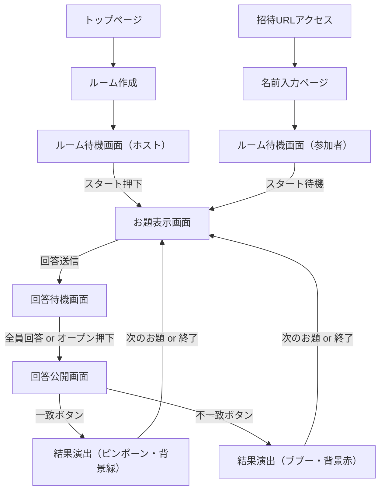
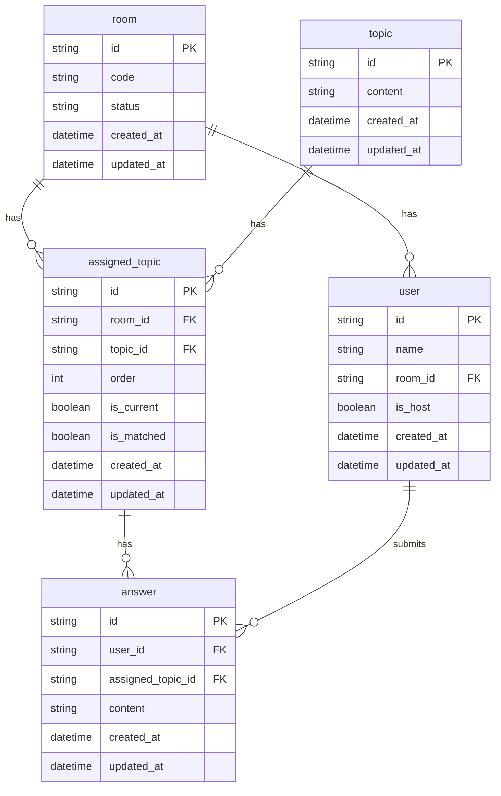

# お題回答一致ゲーム仕様書

## 1. 概要

**現在の状況**: ✅ Phase 6完了・本番稼働中（https://match-party-findy.web.app/）

* ブラウザ上で遊べるリアルタイムお題回答一致ゲーム
* Firebase Firestoreでリアルタイム同期
* 主催者が部屋を作り、URLで参加者を招待
* 全員が同じお題に回答し、一致を目指して遊ぶ
* MVP + Facade + Container-Component統一アーキテクチャ実現

## 2. ユーザー種別

* 主催者
* 参加者

## 3. 機能フロー

### 部屋作成・入室

* 主催者が「部屋を作成」できる（主催者の名前を入力する）
* 部屋固有のURLが発行される
* 参加者はURLからアクセスし「名前を入力して入室」
* 入室後、同じ部屋にいる全参加者の名前をリアルタイム表示

### ゲーム開始

* 主催者が「スタート」ボタンを押すとゲーム開始
* 全員の画面にお題が表示される

### 回答

* 主催者・参加者はそれぞれお題に回答を入力し、送信（確定）する
* 回答済みかどうか（未回答 / 回答済）は全員に表示されるが、内容は非公開

### 回答オープン

* 全員が回答完了、または主催者が「回答をオープン」ボタンを押すと
* 全員の回答内容が全員に公開される

### 判定

* 主催者が「一致」「不一致」ボタンを押す

  * 一致の場合、ピンポーン音と背景色変更（緑など）
  * 不一致の場合、ブブー音と背景色変更（赤など）

### 継続・終了

* 主催者が次のお題を出す、または部屋を閉じて終了できる

## 4. 技術要件

* フロントエンド

  * Webブラウザ対応（PC・スマホ）
  * WebSocket（Socket.IO, Supabase Realtime など）でリアルタイム同期
  * 音声再生（正解・不正解時）
  * 背景色変更演出

* バックエンド

  * 部屋管理（ID, 参加者, お題, 回答状況, 判定結果）
  * WebSocketハンドリング
  * シンプルな認証（名前 + 部屋ID）

* データ構造

  * 部屋ID
  * 部屋内参加者リスト（名前、回答状態）
  * 現在のお題
  * 参加者の回答内容
  * 判定結果（一致 / 不一致）

**room.status** フィールドの値は以下の通り

| 値           | 説明                     |
| ----------- | ---------------------- |
| `waiting`   | 部屋作成直後、参加者入室待ち（ゲーム未開始） |
| `playing`   | お題出題中（回答待ち）            |
| `revealing` | 回答オープン中（全員の回答を公開中）     |
| `ended`     | ゲーム終了                  |

## 5. 非機能要件

* 部屋の有効期限（例: 最終通信から30分で自動削除）
* 参加者上限（例: 20人）
* モバイルでも操作しやすいシンプルUI
* 同時アクセス耐性（Firebase / Supabase / Node.js + WebSocketで運用可能）
* 音声はクライアント側で再生制御

## 6. 追加検討ポイント（任意拡張）

* お題のランダム自動生成機能
* お題履歴表示
* ルームロック機能（開始後の入室不可）
* ルームアイコン・名前カラー変更
* 一致箇所のハイライト表示
* SNSシェア機能

## 7. 技術選定

安価かつシンプルにリアルタイムお題回答ゲームを実装するための技術選定案を、代表的な構成3パターンでメリット・デメリットをまとめます。

---

# 1. Firebase Realtime Database + Firebase Hosting + Firebase Authentication

### メリット

* **サーバーレスで管理不要**：サーバー構築や運用コスト不要。スケールはFirebase側が対応。
* **リアルタイム同期が簡単**：Realtime DatabaseやFirestoreでリアルタイム更新が簡単に実装可能。
* **認証・セキュリティルール標準搭載**：匿名ログインや名前入力など簡単実装可能。
* **無料枠あり**：小規模なら無料枠でまかなえる。

### デメリット

* **カスタマイズ性制限**：バックエンドロジックはCloud Functionsなどで拡張できるが、複雑なビジネスロジックにはやや不向き。
* **データ構造に制約あり**：NoSQL設計が必要で複雑な結合クエリは不得意。
* **WebSocketではなく独自リアルタイム技術**：WebSocketそのものを自分で制御するわけではないため、細かい制御は難しい。

---

# 2. Supabase (PostgreSQL + Realtime + Auth) + Vercel (Next.js)

### メリット

* **PostgreSQLのリレーショナルDB**：複雑なリレーションをSQLで扱える。ER図設計が活かせる。
* **Realtime機能付き**：Postgresの変更をリアルタイム通知（WebSocket）で受け取れる。
* **認証・ユーザー管理機能あり**：メール認証や匿名ログインを簡単に実装可能。
* **サーバーレスでVercelなどにデプロイ可能**：運用コスト低い。
* **GraphQLやREST API自動生成可能**

### デメリット

* **無料枠に制限あり**：利用状況によっては有料化検討が必要。
* **Realtime機能はPostgresの通知ベースでWebSocket自前実装ほど自由度はない**
* **バックエンドに少し知識必要**：SQL設計や認証管理の理解が求められる。

---

# 3. Node.js + Express + Socket.IO + PostgreSQL + Vercel / Railway / Render

### メリット

* **自由度が高い**：細かいリアルタイムロジックや複雑な状態管理が可能。
* **WebSocket制御を自前でできる**：Socket.IOで参加者の接続・切断やイベントを自在に扱える。
* **PostgreSQL等のRDBで複雑なDB設計に対応可能**

### デメリット

* **サーバー運用コストがかかる可能性がある**：特に無料枠を超えると有料化が必要。
* **実装・運用がやや複雑**：サーバー構築、WebSocket管理、スケーリング考慮が必要。
* **開発工数が増える**

---

# まとめ

| 技術構成                     | メリット                 | デメリット               | 向いているケース                 |
| ------------------------ | -------------------- | ------------------- | ------------------------ |
| Firebase (Realtime DB)   | サーバーレス・簡単・無料枠あり      | 複雑ロジック苦手・NoSQL制限あり  | とにかく簡単に早く小規模で作りたい場合      |
| Supabase + Next.js       | RDBの強み＋リアルタイム・サーバーレス | 少し学習コストあり・無料枠に制限    | 将来的に機能拡張も見据えて堅牢に作りたい場合   |
| Node.js + Socket.IO + DB | 自由度最高・柔軟なリアルタイム制御    | 実装・運用コスト高い・サーバー管理必要 | かなりカスタムなリアルタイム挙動を実装したい場合 |

---

もし「まずはとにかく簡単に試作したい」ならFirebase
将来的に複雑化も視野に入れつつ低コストで進めたいならSupabase
リアルタイム制御を完全に自分でカスタマイズしたいならNode.js構成
